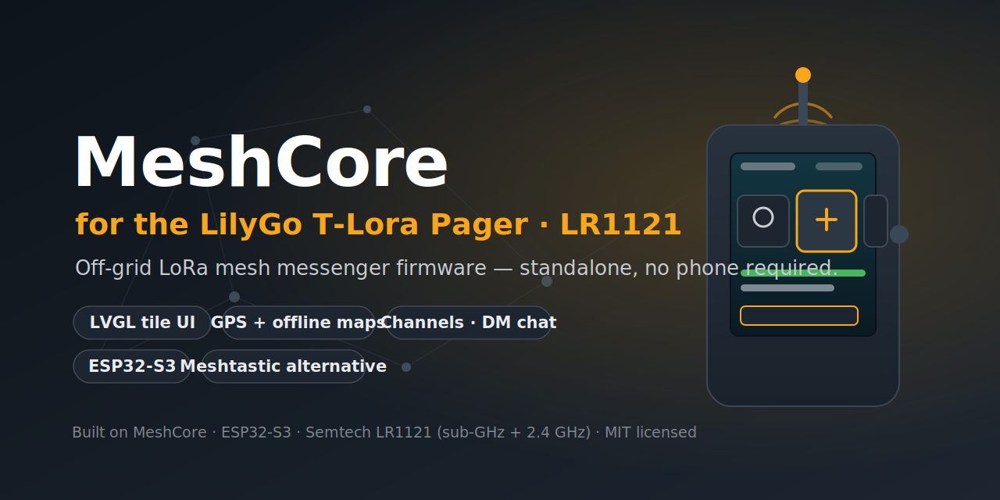

<p align="center">
  
</p>

<h1 align="center">MeshCore for the LilyGo T-Lora Pager (LR1121)</h1>

<p align="center">
  A standalone, off-grid <strong>LoRa mesh messenger</strong> firmware for the
  <strong>LilyGo T-Lora Pager</strong> with the multi-band <strong>Semtech LR1121</strong> radio —
  a <a href="https://meshtastic.org">Meshtastic</a> alternative built on
  <a href="https://github.com/meshcore-dev/MeshCore">MeshCore</a>. No phone required.
</p>

<p align="center">
  <a href="https://github.com/CJvanSoest/meshcore-lilygo-pager-LR1121/actions/workflows/pr-build-check.yml"></a>
  <a href="https://github.com/CJvanSoest/meshcore-lilygo-pager-LR1121/releases/latest"></a>
  
  
  <a href="https://github.com/CJvanSoest/meshcore-lilygo-pager-LR1121/blob/main/license.txt"></a>
</p>

---

The **LilyGo T-Lora Pager** is a pocket LoRa handheld with a colour IPS screen, a
QWERTY keyboard and a scroll-wheel. This firmware turns it into a fully
**standalone MeshCore node** — you read and write channel messages and direct
messages, watch nodes appear on an offline map, and manage the radio, all on the
device itself. It joins the same mesh as any other MeshCore, Meshtastic-style
off-grid network, and works where there is no cell coverage, no WiFi and no
internet.

## ✨ Features

- **Standalone LVGL UI** — a tile carousel (Radio · Channels · DM · Contacts · Discovered · Map · Settings) driven entirely by the scroll-wheel + QWERTY keyboard; no companion phone app needed.
- **Channels & direct messages** — hashtag channels and per-contact DMs with an on-screen keyboard, unread badges, and **per-channel chat history saved to the microSD card** (survives reboots).
- **GPS + offline maps** — live position fix, a satellite-test screen, and a pannable/zoomable **offline map** rendered from tiles on the SD card, with your position and heard nodes drawn on it.
- **Dark / light themes + brightness control** — a white high-contrast theme and Low/Med/Max backlight for readability in bright sunlight; both persist across reboots.
- **On-device radio settings** — frequency, spreading factor, bandwidth, coding rate, TX power, RX-boost and node name, all editable from the UI and saved to flash.
- **Contacts & node discovery** — a live list of heard nodes with SNR/RSSI/distance, plus a "Discovered" view to add new nodes or send adverts.
- **Repeater build** — a low-footprint relay/repeater firmware for the same hardware.

## 📟 Supported hardware

| | |
|---|---|
| **Board** | LilyGo T-Lora Pager (LR1121 variant) |
| **MCU** | Espressif ESP32-S3 (PSRAM) |
| **Radio** | Semtech LR1121 — multi-band, sub-GHz **and** 2.4 GHz |
| **Display** | Sitronix ST7796 IPS LCD |
| **Input** | TCA8418 QWERTY keyboard + rotary encoder / scroll-wheel |
| **Other** | GPS, BQ25896 charger / BQ27220 fuel gauge, XL9555 IO expander, microSD |

> This is the **LR1121** variant. Boards fitted with an SX1262 use a different
> radio driver and are not covered here.

## ⚡ Flashing a pre-built firmware

1. Download the latest firmware from the [**Releases**](https://github.com/CJvanSoest/meshcore-lilygo-pager-LR1121/releases/latest) page. Two builds are published:
   - `…companion_radio_usb…` — the standalone messenger UI (most people want this).
   - `…repeater…` — the relay/repeater build.
2. Flash it with [esptool](https://github.com/espressif/esptool) or the [Adafruit ESPTool web flasher](https://adafruit.github.io/Adafruit_WebSerial_ESPTool/):
   - **`…-merged.bin`** → write to offset **`0x0`** (full image, easiest for a first flash).
   - **`….bin`** (app only) → write to offset **`0x10000`** to update without erasing your saved settings / SD data.
3. **Power on** with the small side button; the UI comes up on the screen.

## 🛠️ Build from source

Built with [PlatformIO](https://platformio.org/):

```bash
# Standalone messenger (companion UI)
pio run -e T_LoRa_Pager_LR1121_companion_radio_usb -t upload

# Repeater
pio run -e T_LoRa_Pager_LR1121_repeater -t upload
```

See [`variants/lilygo_tlora_pager_lr1121/README.md`](variants/lilygo_tlora_pager_lr1121/README.md) for the full build/flash notes, pin map, UI navigation and hardware details.

## 🔌 Power on / off

- **Power on:** the small dedicated button on the side (between the antennas).
- **Power off:** hold the **scroll-wheel / encoder button for ≥ 3 seconds** (the shorter 600 ms hold is the in-UI "back" gesture).

## 📚 Documentation

- [Variant README](variants/lilygo_tlora_pager_lr1121/README.md) — build environments, pin map, UI navigation, on/off, offline map setup.
- [Offline map tiles](variants/lilygo_tlora_pager_lr1121/MAPS.md) — how the SD-card map tiles are laid out.

## 🌐 Built on MeshCore

This is a hardware variant/port of **[MeshCore](https://github.com/meshcore-dev/MeshCore)**, a
lightweight C++ library for multi-hop LoRa packet routing. All credit for the
underlying mesh stack goes to the MeshCore project; this repository adds the
LilyGo T-Lora Pager (LR1121) board support and the standalone on-device UI.
Upstream changes are periodically merged in.

## 📄 License

Released under the **MIT License**, same as upstream MeshCore — see
[`license.txt`](license.txt). Pager variant and UI by CJ van Soest.
